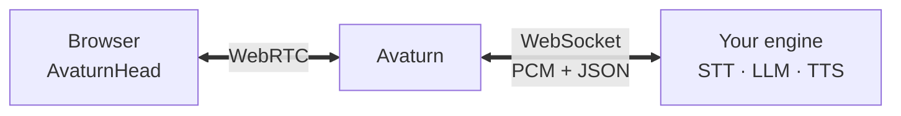
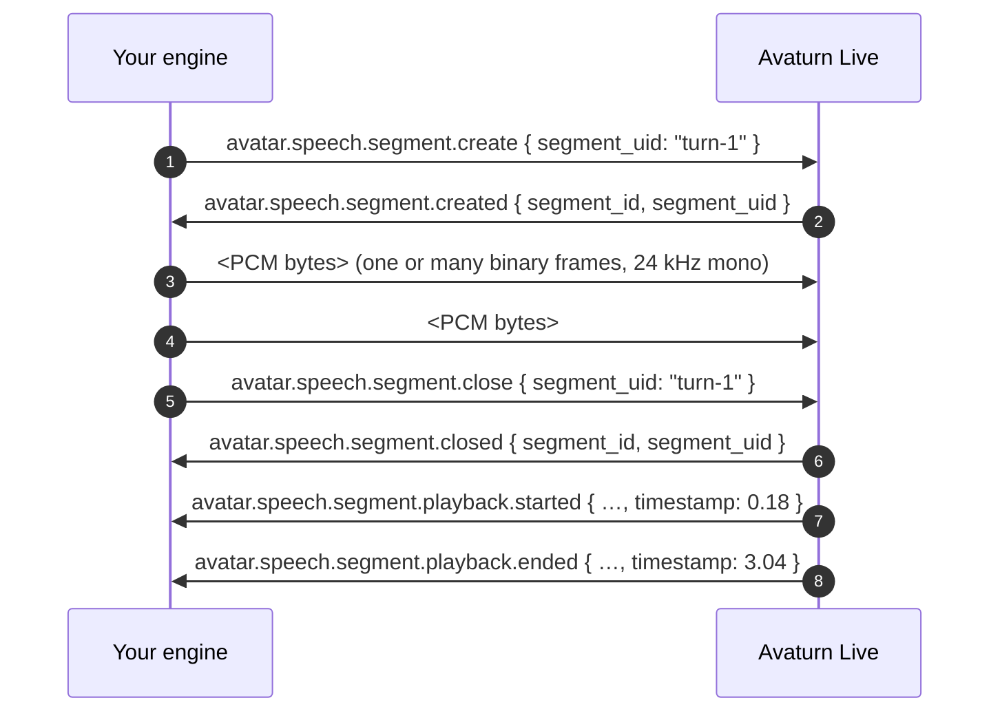

## When to use

- You want full control over the speech stack — STT, LLM, TTS, turn detection, tools, memory — and run it yourself.
- You already have a Pipecat, LiveKit Agents, custom Python/Node, or other voice agent and need to give it a face.
- The hosted engines ([OpenAI Realtime](/howtos/openai_realtime_api), [Cartesia](/howtos/cartesia)) don't fit your pipeline.

A reference implementation (Pipecat + Pipecat Cloud, OpenAI Realtime or cascaded STT/LLM/TTS) lives at [github.com/avaturn-live/pipecat-avaturn-live-demo](https://github.com/avaturn-live/pipecat-avaturn-live-demo).

## How it works



When you create a session with `type: "external"`, Avaturn opens a WebSocket to the `url` you provide and exchanges:

- **Binary** — raw PCM16LE mono audio in both directions.
- **JSON** — small control protocol that frames every burst of avatar speech as a *segment* and propagates playback events back to your engine.

Your engine owns the conversation; Avaturn owns the avatar's mouth, eyes, and playback clock.

## Prerequisites

- **A reachable WebSocket endpoint** — `wss://` in production. Avaturn must reach it over the public internet.
- **Avaturn API key** ([dashboard](https://avaturn.live/dashboard)).
- A way to authenticate the incoming WebSocket (shared secret, signed token, IP allowlist — your choice; see [Authentication](#authentication)).

## 1. Create the Avaturn session

<CodeGroup>
```python Python
import httpx

async with httpx.AsyncClient() as http:
    r = await http.post(
        "https://api.avaturn.live/api/v1/sessions",
        headers={"Authorization": "Bearer <AVATURN_API_KEY>"},
        json={
            "conversation_engine": {
                "type": "external",
                "url": "wss://your-engine.example.com/avaturn-live/ws",
                "audio": {"user": {"sample_rate": 24000}},
                "headers": {"Authorization": "Bearer <YOUR_SHARED_SECRET>"},
            },
        },
    )
    r.raise_for_status()
    session = r.json()  # { "session_id": "...", "token": "..." }
```

```javascript Node.js
const r = await fetch("https://api.avaturn.live/api/v1/sessions", {
  method: "POST",
  headers: {
    Authorization: "Bearer <AVATURN_API_KEY>",
    "Content-Type": "application/json",
  },
  body: JSON.stringify({
    conversation_engine: {
      type: "external",
      url: "wss://your-engine.example.com/avaturn-live/ws",
      audio: { user: { sample_rate: 24000 } },
      headers: { Authorization: "Bearer <YOUR_SHARED_SECRET>" },
    },
  }),
});
const session = await r.json(); // { session_id, token }
```

```bash cURL
curl -X POST https://api.avaturn.live/api/v1/sessions \
  -H "Authorization: Bearer <AVATURN_API_KEY>" \
  -H "Content-Type: application/json" \
  -d '{
    "conversation_engine": {
      "type": "external",
      "url": "wss://your-engine.example.com/avaturn-live/ws",
      "audio": { "user": { "sample_rate": 24000 } },
      "headers": { "Authorization": "Bearer <YOUR_SHARED_SECRET>" }
    }
  }'
```
</CodeGroup>

`conversation_engine` fields:

| Field                    | Type                  | Notes                                                                                                                                                       |
|--------------------------|-----------------------|-------------------------------------------------------------------------------------------------------------------------------------------------------------|
| `type`                   | `"external"`          | Required.                                                                                                                                                   |
| `url`                    | string                | `wss://` URL Avaturn opens. Must be reachable from Avaturn's infra.                                                                                          |
| `audio.user.sample_rate` | `16000` \| `24000`    | Sample rate of the user-mic stream Avaturn sends you. Default `24000`. Use `24000` for speech-to-speech LLMs that consume audio natively (OpenAI Realtime, Gemini Live). Pick `16000` if you'd rather halve the upstream bitrate — most VAD and turn-detection models (Silero, Smart Turn) work at 16 kHz internally. |
| `headers`                | `Record<string,string>` \| `null` | Optional. Forwarded on the WebSocket upgrade — typically `Authorization: Bearer ...`. The values are stored only for the lifetime of the session.            |

Optional top-level session fields: `avatar_id`, `background`, `model` (render model, default `delta`), `user_absent_timeout` (default 60s, min 10), `max_duration` (default 3600s, min 60s, max 86400s). See the [API reference](/api-reference/introduction).

Response:
- `session_id` — backend handle
- `token` — short-lived credential for the Web SDK

## 2. Connect from the frontend

```typescript
import { AvaturnHead } from "@avaturn-live/web-sdk";

// Trigger the mic permission prompt inside the click handler — the SDK
// otherwise calls getUserMedia outside a user gesture and silently fails
// on some browsers.
const stream = await navigator.mediaDevices.getUserMedia({ audio: true });
stream.getTracks().forEach((t) => t.stop());

const root = document.querySelector<HTMLDivElement>("#avaturn-video")!;
const avatar = new AvaturnHead(root, {
  sessionToken: session.token,
  audioSource: true, // required — engine is voice-to-voice
});

await avatar.init();
```

## 3. Implement the WebSocket protocol

Once the session is created, Avaturn opens a WebSocket to your `url` (with your `headers`) and starts streaming the user's microphone immediately.

### Audio

| Direction        | Format                                                |
|------------------|-------------------------------------------------------|
| Avaturn → engine | Binary PCM16LE mono @ `audio.user.sample_rate`        |
| Engine → Avaturn | Binary PCM16LE mono @ **24 kHz** (avatar speech)      |

Resample your TTS output to 24 kHz mono before sending it. Anything else will play back garbled. If your TTS supports native 24 kHz mono output, prefer that over resampling — fewer artifacts and one less CPU step in the hot path.

Chunk size is up to you. 10–40 ms per binary frame works well in practice; Avaturn buffers per segment, so chunk size only affects time-to-first-frame, not playback quality. **Don't throttle output to real-time.** Avaturn Live owns the playback clock and pulls audio as fast as you can produce it — if your framework paces writes by default (some WebSocket transports do), disable that pacing for this socket or segment timing will drift.

### Control messages (engine → Avaturn)

Every chunk of avatar audio must live inside an open **segment**. Open one with `segment.create` before pushing any bytes, then `segment.close` after the last chunk.

```json
{ "type": "avatar.speech.segment.create", "segment_uid": "<your-id>" }
{ "type": "avatar.speech.segment.close",  "segment_uid": "<your-id>" }
{ "type": "avatar.speech.interrupt" }
{ "type": "sdk.message.send", "data": { /* opaque object */ } }
```

- `segment_uid` is your own correlation id (any string). Avaturn echoes it back on the corresponding playback events so you can match them up.
- `avatar.speech.interrupt` discards anything Avaturn has buffered for playback. Use it when your turn detector decides the user has barged in.
- `sdk.message.send` forwards an arbitrary JSON payload to the Web SDK over the data channel (see [Web SDK events](/web-sdk/reference/events)).

Audio sent outside an open segment is dropped and Avaturn replies with an `error` frame — open the segment first.

### Control messages (Avaturn → engine)

```json
{ "type": "avatar.speech.segment.created",   "segment_id": "...", "segment_uid": "..." }
{ "type": "avatar.speech.segment.closed",    "segment_id": "...", "segment_uid": "..." }
{ "type": "avatar.speech.segment.playback.started",     "segment_id": "...", "segment_uid": "...", "timestamp": 0.42 }
{ "type": "avatar.speech.segment.playback.ended",       "segment_id": "...", "segment_uid": "...", "timestamp": 3.18 }
{ "type": "avatar.speech.segment.playback.interrupted", "segment_id": "...", "segment_uid": "...", "played_duration": 1.07 }
{ "type": "sdk.message.receive", "data": { /* opaque object */ } }
{ "type": "error", "subtype": "...", "reason": "..." }
```

- `segment_id` is Avaturn's id; `segment_uid` is the one you supplied. Use whichever is convenient.
- `playback.started` / `playback.ended` fire when the avatar actually starts/finishes lip-syncing the segment — useful for transcript timing.
- `playback.interrupted` fires after `avatar.speech.interrupt` or when a new user utterance pre-empts the current segment.
- `sdk.message.receive` carries messages sent from the browser via the Web SDK.

`error` frames are advisory — the WebSocket stays open. Most common subtypes:

| `subtype`                       | Fires when                                                                                       |
|---------------------------------|--------------------------------------------------------------------------------------------------|
| `avatar.speech.segment.error`   | You pushed audio bytes outside an open segment, or tried to `create` while another was still open. Open / close the segment as expected and retry. |
| `message.type.error`            | An incoming JSON frame had an unknown `type`. Check spelling against the outgoing-message list.  |
| `json.parsing.error`            | An incoming text frame wasn't valid JSON.                                                        |

### Segment lifecycle

A correct turn looks like:



Only one segment can be open at a time. Attempting to `create` while another is open returns an `error` — close the current one first.

## Authentication

Anything reachable on the public internet at a guessable URL is a free avatar — set up auth before exposing the endpoint.

- **Shared secret in `headers`**. Pass `{"Authorization": "Bearer <secret>"}` when creating the session and check it in your WS upgrade handler. Simple and good enough for most deployments.
- **Per-session signed token in the URL path**. Mint a short-lived HMAC token at session-create time and bake it into the `url` (e.g. `wss://engine.example.com/ws/<token>`). The token is single-use and self-expiring, so the secret never leaves your infra. This is the pattern the [reference demo](https://github.com/avaturn-live/pipecat-avaturn-live-demo) uses for Pipecat Cloud.
- **IP allowlist**. Contact [support@avaturn.me](mailto:support@avaturn.me) for the current egress range if you want network-level filtering in front of your service.

## Connection behavior

- **Keep-alive.** Avaturn sends WebSocket pings every ~75 seconds with a 30-second pong timeout. Most reverse proxies need an idle-timeout ≥ 180 seconds in front of your engine to avoid mid-conversation drops — bump `proxy_read_timeout` (nginx), idle timeout (ALB, Cloudflare), or the equivalent. You don't need to send application-level pings yourself; Avaturn's WebSocket-protocol pings are sufficient.
- **Disconnect = session end.** If your engine closes the socket, the Avaturn session ends. If Avaturn closes it (e.g. user disconnected, `max_duration` reached), `recv()` returns end-of-stream — drain and exit cleanly.
- **No automatic reconnect.** Avaturn does not retry failed upgrades or dropped connections inside an active session. Make sure your engine is up before the session starts.

## Session lifecycle

A session ends on any of:

- Explicit `DELETE /api/v1/sessions/{session_id}`
- The conversation-engine WebSocket closing
- `user_absent_timeout` elapses with the user disconnected (default 60s)
- `max_duration` cap reached (default 3600s, max 86400s)

```python
async with httpx.AsyncClient() as http:
    await http.delete(
        f"https://api.avaturn.live/api/v1/sessions/{session_id}",
        headers={"Authorization": "Bearer <AVATURN_API_KEY>"},
    )
```

Call `avatar.dispose()` on the frontend to tear down the local SDK state. The backend session terminates as described above — `dispose()` does not directly close it.

## Reference implementation

[**github.com/avaturn-live/pipecat-avaturn-live-demo**](https://github.com/avaturn-live/pipecat-avaturn-live-demo) — a full open-source reference. Two pipelines ship side-by-side, switchable via a single env var: speech-to-speech (OpenAI Realtime) and cascaded (STT → LLM → TTS). Same transport, serializer, and segment processor wrap both.

- `pipecat_avaturn/serializer.py` — bidirectional Pipecat ↔ Avaturn wire format. Read this first to see the protocol on the wire.
- `pipecat_avaturn/segment_processor.py` — `TTSStartedFrame` / `TTSStoppedFrame` → `segment.create` / `segment.close`.
- `pipecat_avaturn/transport.py` — the Pipecat FastAPI WebSocket transport with its default real-time pacing sleep disabled. The non-obvious gotcha for anyone building a streaming engine — see the "Don't throttle output" note in [Audio](#audio).
- `pipecat_avaturn/broker.py` — minimal client for `POST /api/v1/sessions` with `type: "external"`.
- `server.py` — FastAPI app combining the session broker and the conversation engine in one process.

Fork it, swap in your own STT/LLM/TTS, and you have a production-shaped Avaturn integration in an afternoon.

## See also

- [Web SDK integration guide](/web-sdk/integration-guide)
- [Web SDK events](/web-sdk/reference/events)
- [Avaturn API reference](/api-reference/introduction)
- [OpenAI Realtime engine](/howtos/openai_realtime_api) — hosted alternative.
- [Cartesia engine](/howtos/cartesia) — hosted alternative.